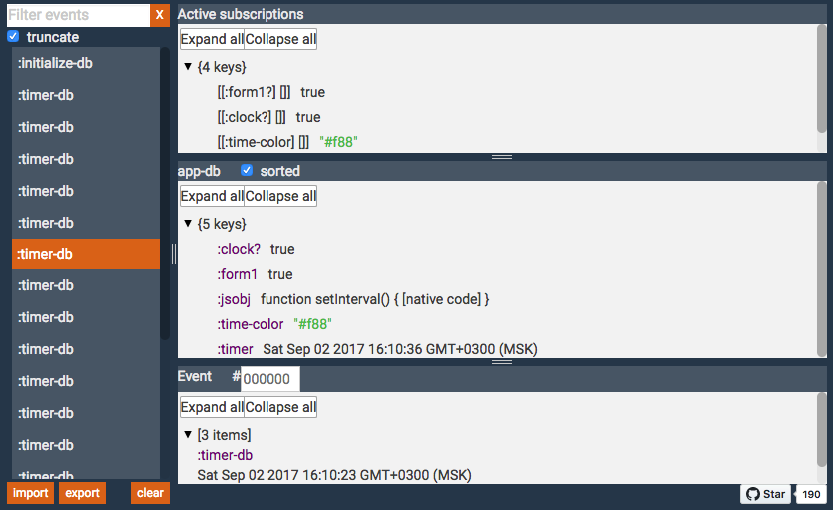

# re-frisk

Visualize [re-frame](https://github.com/Day8/re-frame) pattern data or [reagent](https://reagent-project.github.io) ratom data as a tree structure, watch re-frame events and export state.



## Usage

### Web application

In-app re-frisk debugger. The debugger will be embedded into the interface of your application.
 
[](https://clojars.org/re-frisk)
 
1. Add re-frisk as a dev dependency by placing `[re-frisk "0.5.2"]` within `:profiles :dev :dependencies`. For example:
   
     ```cljs
     :profiles
        {:dev
           {:dependencies [[some-other-package  "0.0.0"]
                           [re-frisk "0.5.2"]] }}
     ```

2. Locate the `:compiler` map under `:dev` and add:
   
     `:preloads             [re-frisk.preload]`

    For example:
    
      ```cljs
      {:builds
         [{:id           "dev"
           :source-paths ["src" "dev"]
           :compiler     {...
                          :preloads [re-frisk.preload]}}]}
      ```
      
ENJOY!

### React native, Electron and Web applications using re-frisk remote server 

Run remote re-frisk debugger server using leiningen re-frisk [plugin](https://github.com/flexsurfer/lein-re-frisk) following next steps:

1. Add `[lein-re-frisk "0.5.3"]` into your global Leiningen config (`~/.lein/profiles.clj`) like so:

    ```cljs
    {:user {:plugins [[lein-re-frisk "0.5.3"]]}}
    ```
    
    or into the `:plugins` vector of your project.clj
    
    ```cljs
    (defproject your-project "0.1.1"
      {:plugins [[lein-re-frisk "0.5.3"]]})
    ```

2. Start a web server in the current directory on the default port (4567):

    `$ lein re-frisk`

    Or select a different port by supplying the port number on the command line:

    `$ lein re-frisk 8095`


3. Add `[re-frisk-remote "0.5.1"]` to the dev `:dependencies` in your project.clj
                                
    run re-frisk using `enable-re-frisk-remote!` function on the localhost and default port (4567)
    
    ```cljs
    (:require [re-frisk-remote.core :refer [enable-re-frisk-remote!]])
    
    (enable-re-frisk-remote!)
    ```
    
    Or select a different host and port by supplying the host and port number:
    
    ```cljs
    (enable-re-frisk-remote! {:host "192.168.1.1:8095"})
    ```
    
    This is just an example, it's better to enable re-frisk in the dev environment

Run an application

ENJOY!

See also [Using re-frisk with re-natal](https://github.com/flexsurfer/re-frisk/wiki/Using-re-frisk-with-re-natal)

### Settings

You can provide starting position for the re-frisk panel

```cljs
(enable-re-frisk! {:x 100 :y 500})

(enable-frisk! {:x 100 :y 500})
```

also, it will be helpful for the IE, because it doesn't support resize property, you can provide width and height

```cljs
(enable-re-frisk! {:width "400px" :height "400px"})

(enable-frisk! {:width "400px" :height "400px"})
```

You can provide external window dimensions

```cljs
(enable-re-frisk! {:ext_height 1000 :ext_width 1200})
```

### Events

If you don't want to watch events you can turn it off providing settings `{:events? false}`

```cljs
(enable-re-frisk! {:events? false})
```

Also you can watch interceptor's context providing `re-frisk.core/watch-context` in the reg-event interceptors list

```cljs
(reg-event-db
 :timer-db
 [re-frisk.core/watch-context]
 (fn
  [db [_ value]]
  (assoc db :timer value)))
```

### Export and Import state of your re-frame application

Export works only for the cljs [data structures](https://github.com/cognitect/transit-cljs#default-type-mapping).


### re-frame 6-domino cascade and re-frisk

[](
https://docs.google.com/drawings/d/1ptKAIPfb_gtwwSqYmt-JGTkwPVm_6LeWjjm-FcWznBs/edit?usp=sharing)


### reagent
If you are not using re-frame in your app, you can run re-frisk without re-frame by `enable-frisk!` function

```cljs
(enable-frisk!)
```

If you want to watch ratom or log any data, you can add it using `add-data` or `add-in-data` functions

```cljs
(add-data :data-key your-data)

(add-in-data [:data-key1  :data-key2] your-data)
```


### For more

re-frame [dev/re_frisk/demo.cljs](https://github.com/flexsurfer/re-frisk/blob/master/dev/re_frisk/demo.cljs).
reagent [dev/re_frisk/reagent_demo.cljs](https://github.com/flexsurfer/re-frisk/blob/master/dev/re_frisk/reagent_demo.cljs).

### Known issues

Works weird in the Internet Explorer which doesn't support css resize property.
Debugger doesn't work in IE.

## Support re-frisk

If re-frisk makes your work with re-frame applications easier and you like it please take a moment and support it:

💎BTC: 3K37vEEyBsKSat2rS74CXUA3LnVR9QPztD

💎ETH: 0x612E124d922a6DE46953226965C8e773166891E9

## License

Copyright © 2016-2017 Andrey Shovkoplyas [andre]

Distributed under the MIT License (MIT)
