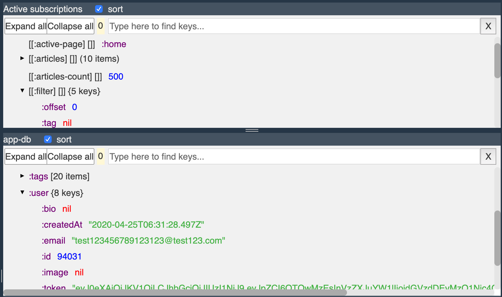
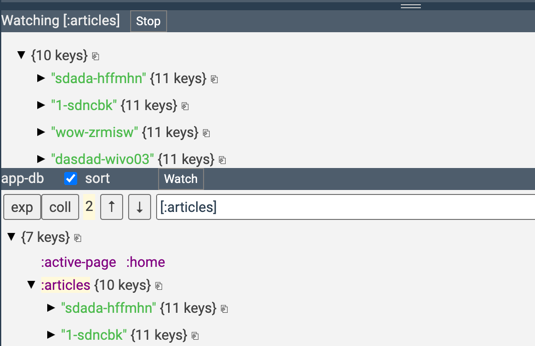
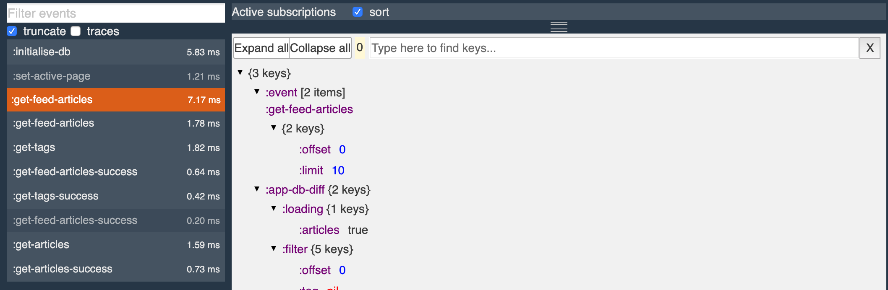
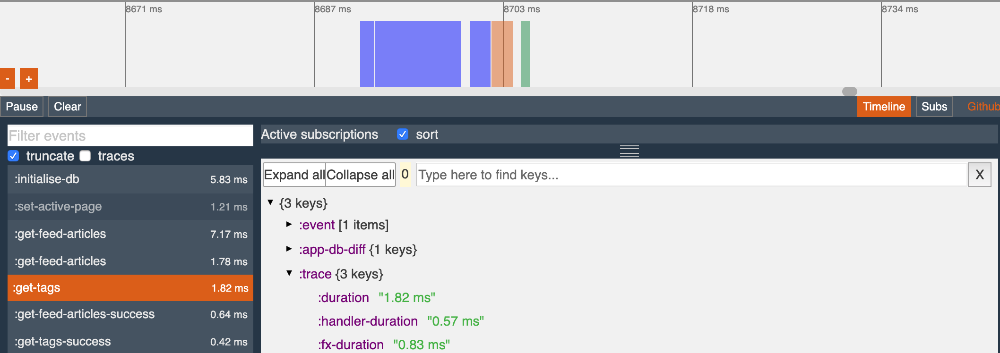

# re-frisk

Take full control of [re-frame](https://github.com/Day8/re-frame) application.

Latest stable version: [](https://clojars.org/re-frisk) [](https://clojars.org/re-frisk-remote)

## DEMO

https://flexsurfer.github.io/conduit-re-frisk-demo/

## Features

### Current state for app-db and subscriptions sorted by keys



### Watching keys from app-db



### Events with app-db difference for each event



### re-frame tracing (**Important**: trace should be [enabled](https://github.com/flexsurfer/re-frisk#enable-traces))

#### Events and timeline (**Important**: with lots of events and high zoom might be slow, pause or clear events when working with timeline)



#### Subscriptions

Render trace is supported only in the re-frisk-remote


#### Views sorted by mount order with subscripions 


#### re-frame handlres statistics


#### Graph for an epoch


#### Graph accumulated for an app life with weights (**Important**: with lots of subscriptions rendering might be slow!)


## Usage

`[re-frisk "1.5.1"]` 
`[re-frisk-remote "1.5.1"]` 

**Important**: Please note the following compatibility table:

re-frisk Version     | React Version     | Reagent Versions
-------------------- | ----------------- | ----------------
`^1.3.4`             | React 16.13.0     | 1.x.x |
`1.1.0-1.3.3`        | React 16.13.0     | 0.10.x |
`1.0.0`              | React 16.9.0      | 0.9.x |
`0.5.3`              | React 16 - 16.8.6 | 0.8.x | 

### Web application

[](https://clojars.org/re-frisk)

re-frisk will be embedded in the DOM of your application. So my suggestion is to use re-frisk-remote, it doesn't affect your application and has more features
 
1. Add re-frisk as a dev dependency  `[re-frisk "1.5.1"]` 

2. Enable re-frisk

    `:preloads  [re-frisk.preload]`

    OR
    
    `(:require [re-frisk.core :as re-frisk])`
    
    `(re-frisk/enable)`
      

### React Native, Electron or Web applications

[](https://clojars.org/re-frisk-remote)

1. Add re-frisk as a dev dependency `[re-frisk-remote "1.5.1"]` 

2. Enable re-frisk on default port (4567):

    `:preloads [re-frisk-remote.preload]`

    OR
    
    `(:require [re-frisk-remote.core :as re-frisk-remote])`
    
    `(re-frisk-remote/enable)`
    
3. Start re-frisk on default port (4567):

    `shadow-cljs run re-frisk-remote.core/start`

    OR
    
    add in `deps.edn`
    
    `:aliases {:dev {:extra-deps {re-frisk-remote {:mvn/version "1.5.1"}}}}}`
    
    create `re_frisk.clj`
    
    ```clojure
   (ns re-frisk
     (:require [re-frisk-remote.core :as re-frisk-remote]))
   
   (re-frisk-remote/start)
    ```
    
    `clj -R:dev re_frisk.clj`

Open re-frisk in a browser at http://localhost:4567

When remote debugging on an Android device you might need to enable reverse socket connections on port 4567:

```bash
adb reverse tcp:4567 tcp:4567
```
### Enable traces

shadow-cljs
```clojure
:compiler-options {:closure-defines {"re_frame.trace.trace_enabled_QMARK_" true}}
```

OR

```clojure
:compiler         {:closure-defines {"re_frame.trace.trace_enabled_QMARK_" true}}
```

### Settings

External window dimensions

```clojure
(re-frisk/enable {:ext_height 1000 :ext_width 1200})
```

If you don't need to watch events you can disable them

```clojure
(re-frisk/enable {:events? false})
```

or exclude specific events 

```clojure
(re-frisk/enable {:ignore-events #{::timer-db}})
```

Using custom IP or port

```clojure
(re-frisk-remote/enable {:host "192.168.0.2:7890"})

(re-frisk-remote/start {"7890"})
```

Normalize app-db before send to re-frisk

```clojure
(re-frisk-remote/enable {:normalize-db-fn (fn [app-db] (reduce ...))})
```


### bonus re-frame 6-domino cascade

[](
https://docs.google.com/drawings/d/1ptKAIPfb_gtwwSqYmt-JGTkwPVm_6LeWjjm-FcWznBs/edit?usp=sharing)
