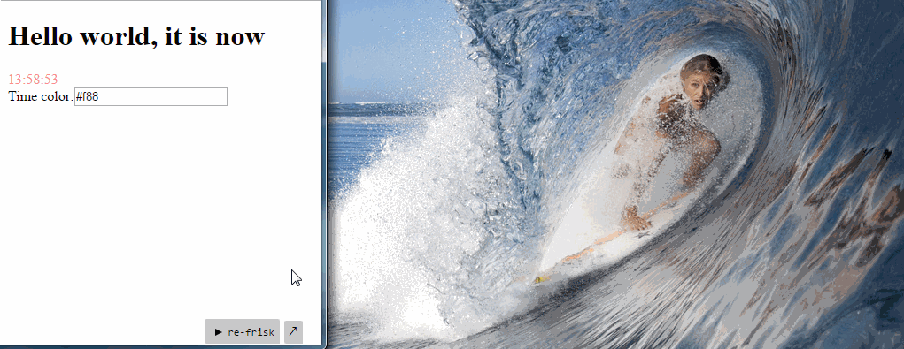

# re-frisk

Visualize [re-frame](https://github.com/Day8/re-frame) pattern data or [reagent](https://reagent-project.github.io) ratom data as a [tree structure](https://github.com/Odinodin/data-frisk-reagent).

Also you can watch re-frame events and export state in the debugger.


## Setup

[](https://clojars.org/re-frisk)

Add `[re-frisk "0.3.0"]` to the dev `:dependencies` in your project.clj


## Usage

### re-frame
run re-frisk after document will be loaded and before any rendering calls, using `enable-re-frisk!` function

```clojure
(:require [re-frisk.core :refer [enable-re-frisk!]])

(defn ^:export run
 []
 (dispatch-sync [:initialize])
 (enable-re-frisk!)
 (reagent/render [simple-example]
                 (js/document.getElementById "app")))
```

ENJOY!

### reagent
If you are not using re-frame in your app, you can run re-frisk without re-frame by `enable-frisk!` function

```clojure
(enable-frisk!)
```

If you want to watch ratom or log any data, you can add it using `add-data` or `add-in-data` functions

```clojure
(add-data :data-key your-data)

(add-in-data [:data-key1  :data-key2] your-data)
```

### Debugger

You can export and import app state, and watch events in the separate debugger window.
Unfortunately debugger doesn't work in IE.

Export works only for the cljs [data structures](https://github.com/cognitect/transit-cljs#default-type-mapping).


### Settings

You can provide starting position for the re-frisk panel

```clojure
(enable-re-frisk! {:x 100 :y 500})

(enable-frisk! {:x 100 :y 500})
```

also, it will be helpful for the IE, because it doesn't support resize property, you can provide width and height

```clojure
(enable-re-frisk! {:width "400px" :height "400px"})

(enable-frisk! {:width "400px" :height "400px"})
```


## Advanced thing

You can watch all re-frame views which are rendering now

Add `:external-config {:re-frisk {:enabled true}}}}` to the dev `:compiler` in your project.clj if you are working with the re-frame app


this config needed to do not generate any code in production.


Require macro
```clojure
(:require [re-frisk.core :refer-macros [def-view]])
```

Define your views (components) with the `def-view` macro

```clojure
(def-view greeting
 [message]
 [:h1 message])
```


### For more

re-frame [dev/re_frisk/demo.cljs](https://github.com/flexsurfer/re-frisk/blob/master/dev/re_frisk/demo.cljs).
reagent [dev/re_frisk/reagent_demo.cljs](https://github.com/flexsurfer/re-frisk/blob/master/dev/re_frisk/reagent_demo.cljs).

### Known issues

Works weird in the Internet Explorer which doesn't support css resize property.
Debugger doesn't work in IE.

If you are using `reagent.core/create-class` function for creating views, data for these views will be still showing in the re-frisk after this components will be unmounted.

## License

Copyright © 2016 Shovkoplyas Andrey [motor4ik]

Distributed under the MIT License (MIT)
