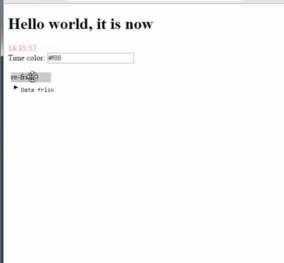
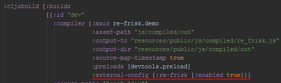

# re-frisk

Visualize [re-frame](https://github.com/Day8/re-frame) pattern data in your re-frame apps as a tree structure.
Since 0.1.1 not only for re-frame app, you can use it for reagent apps too.



## Overview

This lightweight library helps you to visualize re-frame data and easily debug re-frame apps in the real time.

[![Clojars Project]](https://clojars.org/re-frisk)
[![GitHub license]](LICENSE)
[![Sample Project]](https://github.com/flexsurfer/re-frisk/blob/master/dev/re_frisk/)

## Setup

Add `[re-frisk "0.1.1"]` to the dev `:dependencies` in your project.clj

Add `:external-config {:re-frisk {:enabled true}}}}` to the dev `:compiler` in your project.clj



## Usage

Require macro

```clojure
(:require [re-frisk.core :refer-macros [def-view]])
```

Define your views (components) with the `def-view` macro

```clojure
(def-view greeting
 [message]
 [:h1 message])
```

ENJOY!
Наслаждайтесь :)

If you want to watch only app-db without views you can run re-frisk manually using `enable-re-frisk!` function

```clojure
(:require [re-frisk.core :refer [enable-re-frisk!]])

(enable-re-frisk!)
```

And you can provide starting position for the re-frisk panel

```clojure
(enable-re-frisk! {:x 100 :y 500})
```

also, it will be helpful for the IE, because it doesn't support resize property, you can provide width and height

```clojure
(enable-re-frisk! {:width 400 :height 400})
```

If you want to watch not re-frame data, you can add it using `add-data` function

```clojure
(add-data :data-key your-data-atom)
```

Finally, if you are not using re-frame in your app, you can run re-frisk without re-frame by `enable-frisk!` function

```clojure
(enable-frisk!)
```

### For more

See the [dev/re_frisk/demo.cljs](https://github.com/flexsurfer/re-frisk/blob/master/dev/re_frisk/demo.cljs).

### Known issues

Works weird in the Internet Explorer which doesn't support css resize property.

If you are using `reagent.core/create-class` function for creating views, data for these views will be still showing in the re-frisk after this components will be unmounted.

## License

Copyright © 2016 Shovkoplyas Andrey [motor4ik]

Distributed under the MIT License (MIT)
