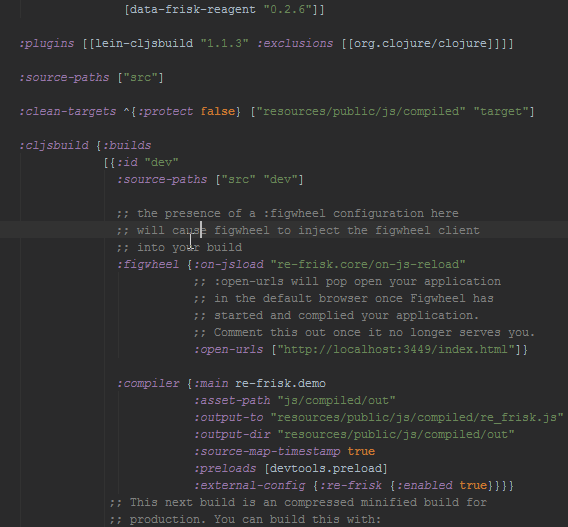

# re-frisk

Visualize re-frame pattern data in your re-frame apps as a tree structure.



## Overview

This lightweight library helps you to visualize re-frame data and easily debug re-frame apps in the real time.

## Setup

Add `[re-frisk "0.1.0"]` to the dev `:dependencies` in your project.clj

Add `:external-config {:re-frisk {:enabled true}}}}` to the dev `:compiler` in your project.clj


## Usage

Require macro

```clojure
(:require [re-frisk.core :refer-macros [def-view]])
```

Define your views (components) with the `def-view` macro

```clojure
(def-view greeting
 [message]
 [:h1 message])
```

ENJOY!
Наслаждайтесь :)

### For more

See the dev/re_frisk/demo.cljs.

### Known issues

Works weird in the Internet Explorer which doesn't support css resize property.

## License

Copyright © 2016 Shovkoplyas Andrey [motor4ik]

Distributed under the MIT License (MIT)
